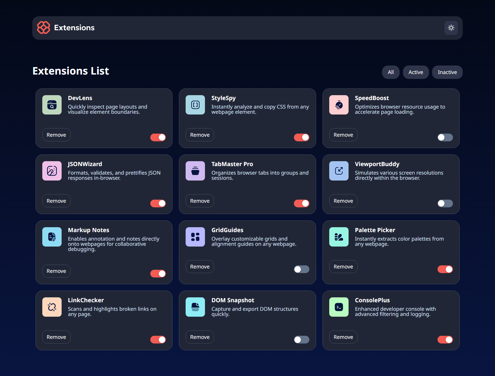
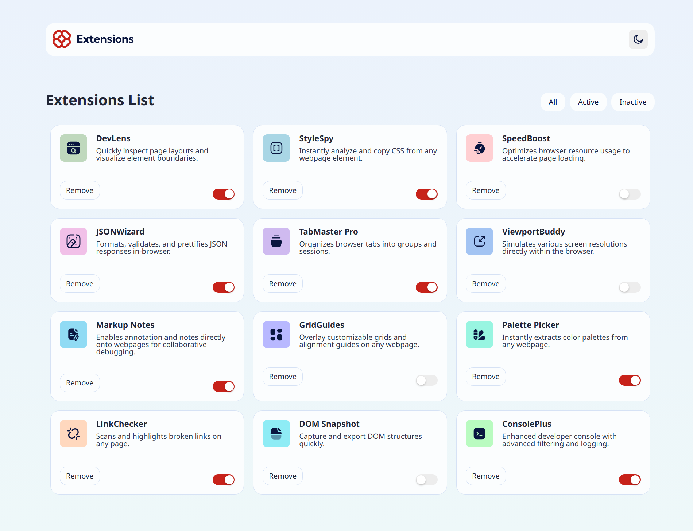

# Frontend Mentor - Browser extensions manager UI solution

This is a solution to the [Browser extensions manager UI challenge on Frontend Mentor](https://www.frontendmentor.io/challenges/browser-extension-manager-ui-yNZnOfsMAp). Frontend Mentor challenges help you improve your coding skills by building realistic projects. 

## Table of contents

- [Overview](#overview)
  - [The challenge](#the-challenge)
  - [Screenshot](#screenshot)
  - [Links](#links)
- [My process](#my-process)
  - [Built with](#built-with)
  - [What I learned](#what-i-learned)
  - [Continued development](#continued-development)
- [Author](#author)
- [Acknowledgments](#acknowledgments)

## Overview

### The challenge

My task was to build out a browser extension manager UI as close to the provided design as possible.

Users should be able to:

- Toggle extensions between active and inactive states
- Filter active and inactive extensions
- Remove extensions from the list
- Select their color theme
- View the optimal layout for the interface depending on their device's screen size
- See hover and focus states for all interactive elements on the page

### Screenshot

### Links

- Solution URL: (https://github.com/oahann/Extensions.git)
- Live Site URL: [Add live site URL here](https://your-live-site-url.com)

## My process

### Built with

- Semantic HTML5 markup
- CSS custom properties
- Flexbox
- CSS Grid
- React (with functional components)
- Custom theme context (light/dark mode)
- SCSS Modules

### What I learned

- How to manage UI state with React hooks (useState, useContext)
- Structuring reusable components like SwitchButtons
- Managing list rendering with unique key props
- Debugging layout/padding issues in media queries

### Continued development

- Animations for toggle and delete actions
- Unit tests for filter logic
- Using TypeScript for stronger type safety

## Author

- Frontend Mentor - [@oahann](https://www.frontendmentor.io/profile/oahann)

## Acknowledgments

Big thanks to the Frontend Mentor team for this great project idea and all the community feedback!
